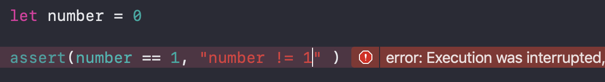

## Assertion

Assertion은 디버깅할 때 사용하면 유용하다.

Assertion 함수는 여러가지가 있다.

* assert()
* precondition()

코드가 실행될 때 반드시 만족해야 하는 조건을 체크하는 데

조건이 만족되면 넘어가고 만족되지 않으면 작성해놓은 메세지(메세지는 없어도 상관없음)를 

콘솔에 출력하고 동작을 중지 시킨다.

<br/>



<br/>

```swift
func getAge(age: Int?) -> Int? {
    if let age = age {
        assert(age != nil)
        assert(age >= 0)
        return age
    }
    return nil
}
if let age = getAge(age: 20) {
    print("age: \(age)") //age: 20
}
```

<br/>

* assertionFailure()
* preconditionFailure()

조건식이 없는데 실패하는 상황 실행되면 안되는 코드가 실행되면 호출된다


```swift
func tableView(_ tableView: UITableView,
               cellForRowAt indexPath: IndexPath) -> UITableViewCell {
    let anyCell = tableView.dequeueReusableCell(withIdentifier: "cell",
                                                for: indexPath)

    guard let cell = anyCell as? MyCustomCell else {
        assertionFailure("예상하지 못 한 셀 타입: \(type(of: anyCell))")
        return anyCell
    }

    // 셀 설정
    ...
}
```

<br/>

* fatalError() 

잘 사용되지는 않지만 에러를 발생시키고 앱이 중지되도록 한다.

<br/>

<br/>

assert() 와 assertionFailure() 함수는 디버그 모드(-Onone)에서만 동작(Evaluation)한다. 

즉 assert() 와 assertionFailure() 는 릴리즈 모드(-Ofast)에서는 아무런 역활을 하지 않는다.

precondition() 과 preconditionFailure() 함수는 디버그(-Onone)나 릴리즈(-Ofast) 모드를 가리지 않고 항상 체크한다.

<br/>

<br/>

### 참고링크

* [Assertion 살펴보기_PilGwonKim](https://pilgwon.github.io/blog/2017/09/25/Under-the-Hood-of-Assertions-in-Swift.html)
* [Assertion과 컴파일 최적화 _ Seorenn SIGSEGV]([http://seorenn.blogspot.com/2016/05/swift-assertion.html](http://seorenn.blogspot.com/2016/05/swift-assertion.html))

