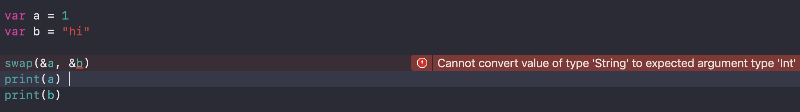

## 제네릭

<br/>

다음은 inout 을 공부할때 봤던 swapTwoInts 예제이다.

이 함수는 Int 값만 사용할수 있는데 다른 타입으로 바꾸고 싶다면 함수를 또 작성해야한다.

즉 중복코드가 발생한다.

<br/>

```swift
func swapTwoInts(a: inout Int, b: inout Int) {
    let tempA = a
    a = b
    b = tempA
}

var a = 10
var b = 15

swapTwoInts(a: &a, b: &b)

print(a) //15
print(b) //10

func swapTwoDoubles(a: inout Double, b: inout Double) {
    let tempA = a
    a = b
    b = tempA
}

var aa = 10.5
var bb = 15.5

swapTwoDoubles(a: &aa, b: &bb)

print(aa) //15.5
print(bb) //10.5


```

<br/>

<br/>이 때 제네릭 코드를 사용하면 중복을 줄일 수있다.

함수 정의시 `<T>` 정의하고 실제 타입 대신 T로 명시한다.

T의 실제 타입은 함수 호출 시 결정된다. T는 함수 인자로 전달된 값으로부터 타입 추론한다.

> 실제로 값을 swap하는 함수를 구현하려면 Swift 표준라이브러리인 swap 함수를 사용하는것을 권장

<br/>

```swift
func swapTwoValues<T>(a: inout T, b: inout T) {
    let tempA = a
    a = b
    b = tempA
}

var a = 1
var b = 2

swap(&a, &b)
print(a) //2
print(b) //1

var aa = "aa"
var bb = "bb"

swap(&aa, &bb)
print(aa) //bb
print(bb) //aa

```

<br/>

<br/>



<br/>

이 때 다른 타입끼리는 swap 이 불가능하다. 

가능하도록 하려면 전달인자 변수에 Any 타입을 명시해주면 된다.

<br/>

```swift
func swapTwoValues<T>(a: inout T, b: inout T) {
    let tempA = a
    a = b
    b = tempA
}

var a: Any = 10
var b: Any = "hi"

swapTwoValues(a: &a, b: &b)

print(a) //hi
print(b) //10
```

<br/>

<br/>

하나 이상의 타입 인자를 사용할수 있고 `<T, M>`  꺽쇠 안에서 타입 이름을 콤마로 분리한다.

<br/>

```swift
func getTwoValues<T, M>(a: T, b: M) {
    print("\(type(of: a)) typeof \(a)") //Int typeof 10
    print("\(type(of: b)) typeof \(b)") //String typeof hi
}

var a = 10
var b = "hi"

getTwoValues(a: a, b: b)
```

<br/>

<br/>

 클래스, 구조체, 열거형으로 자신만의 제네릭 타입을 정의할 수 있다.

Stack 이라는 제네릭 컬렉션 타입을 만드는데 스택은 값의 순서가 있는 배열과 유사하지만

배열은 새로운 요소를 배열 안에 어디든 넣고 제거할 수 있고, 스택은 끝에만 

넣고 제거하는 push() pop() 의미에서 Swift 배열 타입보다 좀 더 엄격하다고 할수 있다.

<br/>

제네릭을 사용하지 않은 예제로 IntStack 구조체는 Int 값만 사용할수 있다.

```swift
struct IntStack {
    var items = [Int]()
    mutating func push(item: Int) {
        items.append(item)
    }
    mutating func pop() -> Int {
        return items.removeLast()
    }
}

```

<br/>

<br/>

제네릭을 사용하면 타입에 좀더 유연하게 대응한다.

```swift
struct Stack<T> {
    var items = [T]()
    mutating func push(item: T) {
        items.append(item)
    }
    mutating func pop() -> T {
        return items.removeLast()
    }
}

var stack = Stack<String>()
stack.push(item: "a")
stack.push(item: "b")
stack.push(item: "c")
print(stack) //Stack<String>(items: ["a", "b", "c"])
print(stack.items) //["a", "b", "c"]

let lastItem = stack.pop()
print(lastItem) //c
print(stack.items) //["a", "b"]
```


<br/>

<br/>

<br/>

### 참고링크

[민소네_[Swift]Generics 정리](http://minsone.github.io/mac/ios/swift-generics-summary)