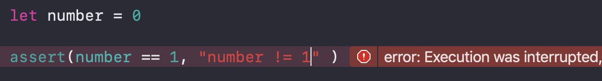

## assert

Assertion은 디버깅할 때 사용하면 유용하다.

코드가 실행될 때 반드시 만족해야 하는 조건을 체크하는 데

조건이 만족되면 넘어가고 만족되지 않으면 작성해놓은 메세지(메세지는 없어도 상관없음)를 

콘솔에 출력하고 동작을 중지 시킨다.

디버깅 모드에서만 사용가능하다.



<br/>

```swift
func getAge(age: Int?) -> Int? {
    if let age = age {
        assert(age != nil)
        assert(age >= 0)
        return age
    }
    return nil
}
if let age = getAge(age: 20) {
    print("age: \(age)") //age: 20
}
```

