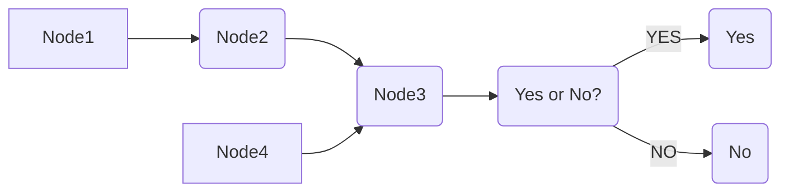
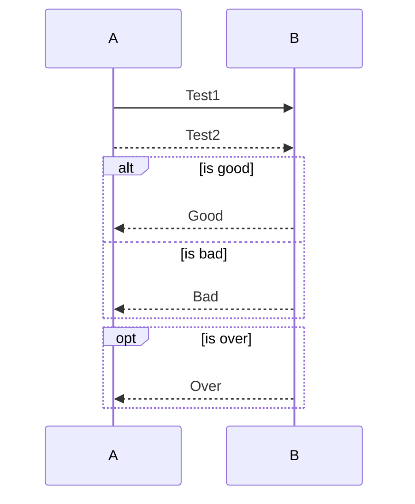

# Markdown syntax (19.04.24)

> 기본 작성 tip 

```
# Headers 1~6 까지 지원

> BlockQuote

* / + / - 순서없는 목록 (tab 과 shift+tab으로 들여쓰기 내어쓰기)

123 순서있는 목록

​``` normal paragraph & code block ```

--- / *** / +++ <hr/>  수평선

**emphasize** 강조
*italic* / _italic_ 기울여쓰기
~~cancelline~~ 취소선 
<u>underline</u> underline

```

<br/>

<br/>

문서 내부 링크 이동

[다사 찾아보기](#다시-찾아보기)

```
[keyword](#이동할위치텍스트)
영어는 소문자만 가능하고 띄어쓰기는 -로 구분한다
```

<br/>

<br/>

- [ ] Check List

```
- [ ] Check List
```

<br/>

<br/>

>  Emoji :smile:

```
:smile: 
```

<br/>

<br/>

`단어` 단어블럭? 

```
`단어`
```

<br/>

<br/>

> Footnotes 

You can create footnotes like this[^footnote].

[^footnote]: here is the *text* of the **footnote**

```
You can create footnotes like this[^footnote].

[^footnote]: here is the *text* of the **footnote**.
```

<br/>

<br/>

> link:  [loveapplepi][https://github.com/loveapplepi]

```
[link keyword][id] 링크
syntax: [title](link) 인라인링크
```

<br/>

<br/>

> 다시 찾아보기

```
==highlight== 하이라이트 (왜 안되지 이제 지원안하나?)
(^1.) 주석기능 
This book(^1.) is interesting.
```

<br/>

<br/>

> $\lim_{x \to \infty} \exp(-x) = 0$  수학공식 `$`로 감싸는 형태로 작성

```
$\lim_{x \to \infty} \exp(-x) = 0$   
```

<br/>

<br/>

> Math Blocks  `$$` 를 입력

```
$$
\mathbf{V}_1 \times \mathbf{V}_2 =  \begin{vmatrix} 
\mathbf{i} & \mathbf{j} & \mathbf{k} \\
\frac{\partial X}{\partial u} &  \frac{\partial Y}{\partial u} & 0 \\
\frac{\partial X}{\partial v} &  \frac{\partial Y}{\partial v} & 0 \\
\end{vmatrix}
$$
```

$$
\mathbf{V}_1 \times \mathbf{V}_2 =  \begin{vmatrix} 
\mathbf{i} & \mathbf{j} & \mathbf{k} \\
\frac{\partial X}{\partial u} &  \frac{\partial Y}{\partial u} & 0 \\
\frac{\partial X}{\partial v} &  \frac{\partial Y}{\partial v} & 0 \\
\end{vmatrix}
$$

<br/>

<br/>

> 이미지

```
 이미지
 이미지
</img> 이미지 사이즈 조절
 이미지 사이즈 조절 및 정렬
(단, 이미지는 문법을 쓰지 않고도 복사, 붙여넣기 드래그앤드랍으로 이미지 넣기가 가능하다. )
```

<br/>


~~사심가득.jpg~~

<br/><br/>

> 다이어그램 작성

```
flow 작성
​``` flow 선택후

st=>start: Start
op=>operation: My opration
cond=>condition: Yes or No
e=>end: End
st->op->cond
cond(yes)->op
cond(no)->e

이런 식으로 다이어그램을 작성할 수 있다.
```

```flow
st=>start: Start
op=>operation: My opration
cond=>condition: Yes or No
e=>end: End
st->op->cond
cond(yes)->op
cond(no)->e
```

<br/>

<br/>

> 시퀀스 다이어그램 작성

```
​```mermaid

graph LR
A[Node1]-->B(Node2)
B-->C(Node3)
D[Node4]-->C
C-->E(Yes or No?)
E-->|YES| F(Yes)
E-->|NO| G(No)

```



<br/><br/>

> 옵션까지 표현한 시퀀스 다이어그램

```
​```mermaid

sequenceDiagram
A->>B: Test1
A-->>B: Test2
alt is good
B-->>A: Good
else is bad
B-->>A: Bad
end
opt is over
B-->>A: Over
end
```



<br/><br/>

> table 만들기 `option` + `command` + `T`

|      |      |
| ---- | ---- |
|      |      |
|      |      |


<br/><br/><br/>

참고 link

* [마크다운 작성법][https://gist.github.com/ihoneymon/652be052a0727ad59601]

* [글 쓰고 싶어지는 에디터 - Typora][http://morethanair.com/archives/404]

* [마크다운 문법][https://shjchad78.tistory.com/18]


