## FCM을 사용해서 푸시 알람 받기

FCM 이란?

Firebase Cloud Messaging 

메세지를 전송할수 있는 서비스

쉽게 말하면 앱에서 푸시 알람 오는 서비스를 구현하는 것중 하나

GCM(google Cloud Messaging) 으로 구현하는 방법도 있다.

 

 

    먼저, Xcode 프로젝트 생성하기 

 

 

 

다음은 키체인 접근 - 인증서 지원 - 인증 기관에서 인증서 요청을 한뒤

 

 

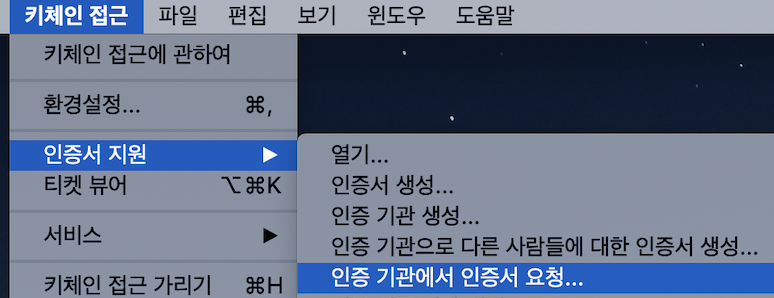

 

 

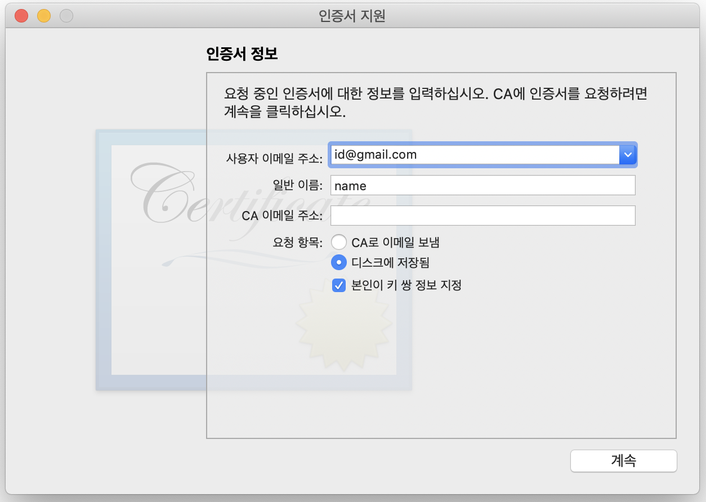

  

이메일주소를 적어주고 

- [ ] CA로 이메일 보냄

- [x] 디스크에 저장됨
- [x] 본인이 키 쌍 정보 지정

아래 두 항목을 체크해준 뒤에 `계속 ` 을 눌러서 저장 해준다.  (따로 관리할 파일을 만들어도 좋음)

 

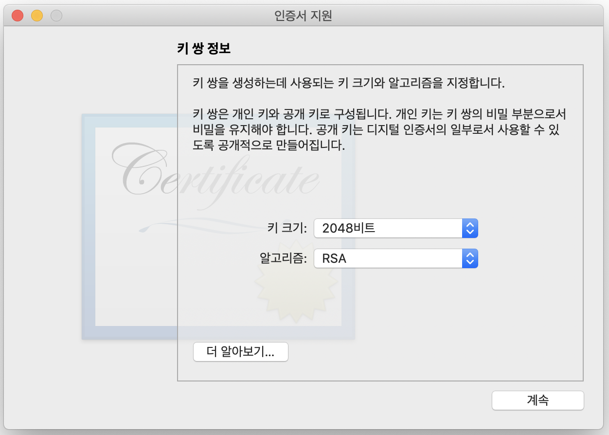

키 쌍 정보는 기본값 그대로 2048비트, RSA로 지정해주고 `계속`  

인증서 요청이 디스크에 생성되었습니다. 가 나오면 `완료`

 

 

[apple account cerificate](https://developer.apple.com/account/ios/certificate/) 로 이동

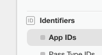

Identifiers - App IDs에 들어가서 우측 상단의 `+` 버튼을 눌러 추가 해준다.

 

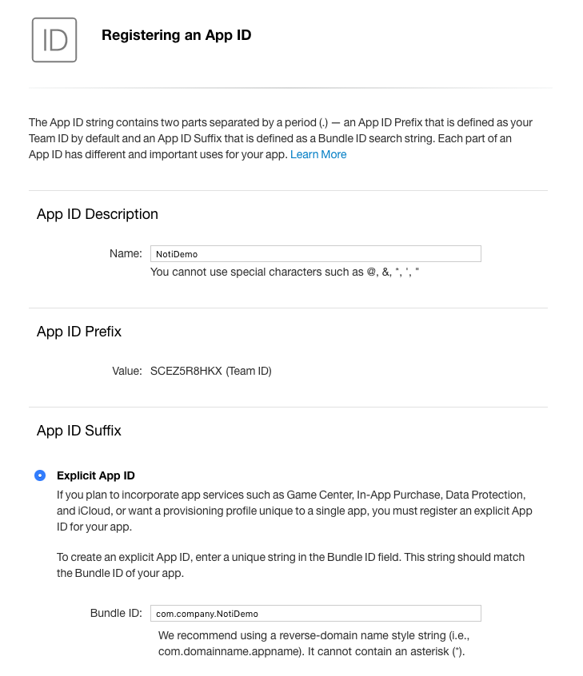

 

여기서 Bundle ID에는 Xcode 프로젝트에 있는 Bundle Identifier을 적어준다.

 

 

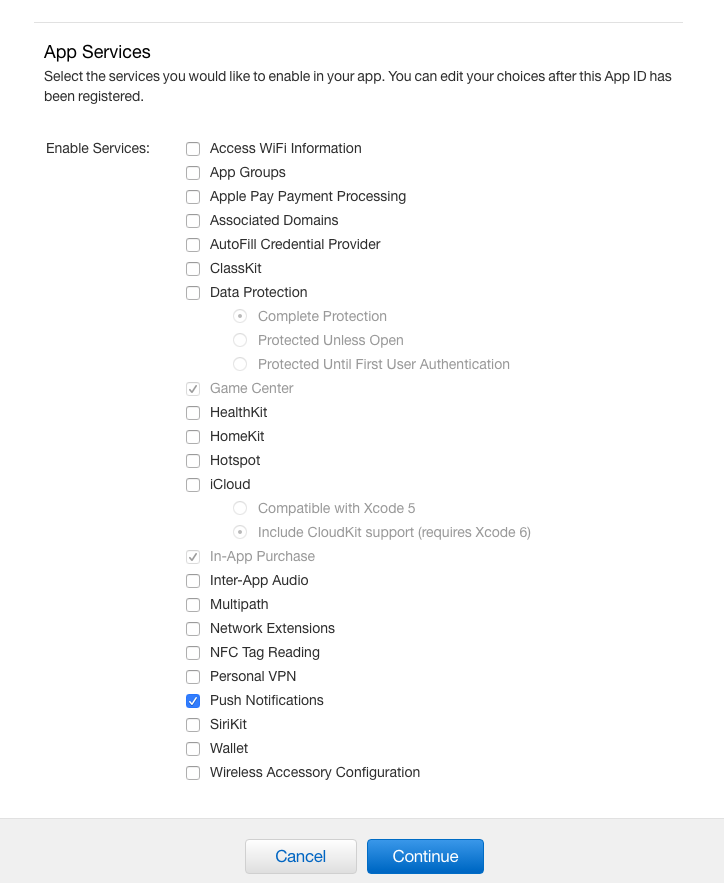

App Services 에서 Push Notifications 를 체크해주고 `Continue`  누르면 다음 화면에 

 

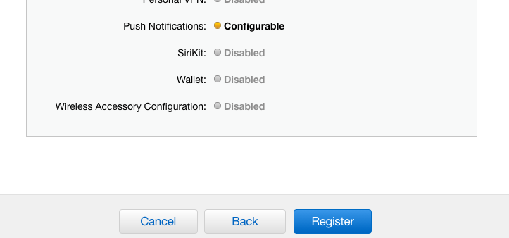

Push Notifications: Configurable 되있을것이다. `Register` 누르면

 

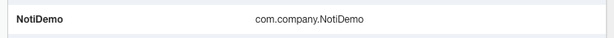

다음과 같이 등록 된걸 확인할 수 있다.

 

  

다음은 인증서를 추가하러 가자.

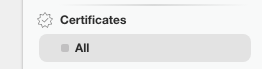

 

Certificates - All 에서 우측 상단에 `+`  누르고

 

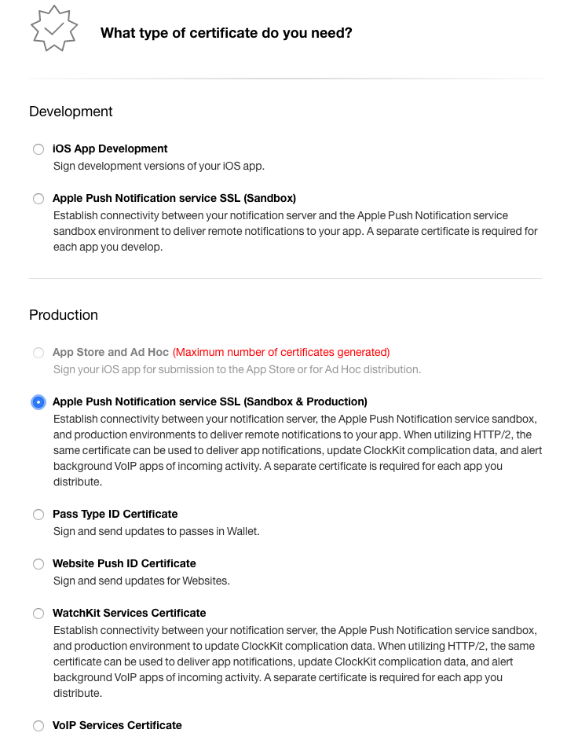

Development 항목이 아닌 Production 항목에서 

- [x] Apple push Notification service SSL (Sandbox & Production) 

항목 체크한 후 `Continue`  

 

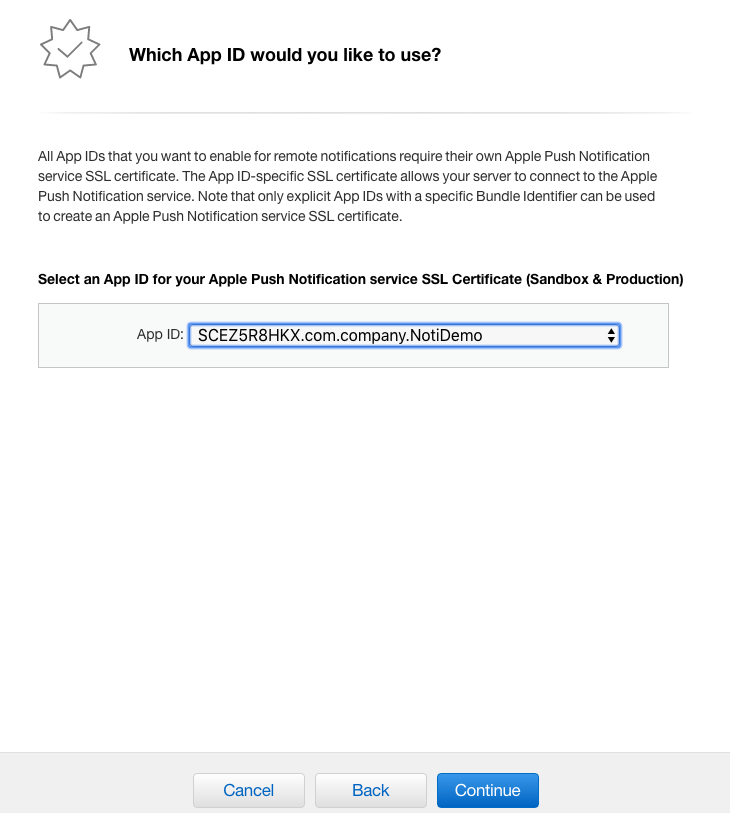

방금 전에 만든 App ID를 선택하고 `Continue`

 

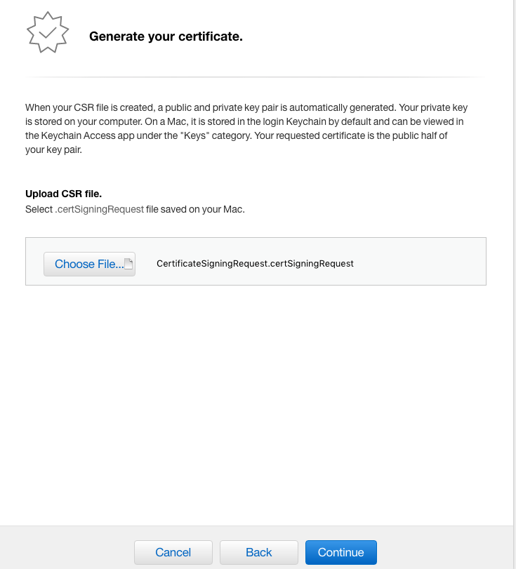

처음에 인증서 요청해서 저장했던 인증서를 `Choose Flie`를 선택해서 넣어주고 `Continue`

 

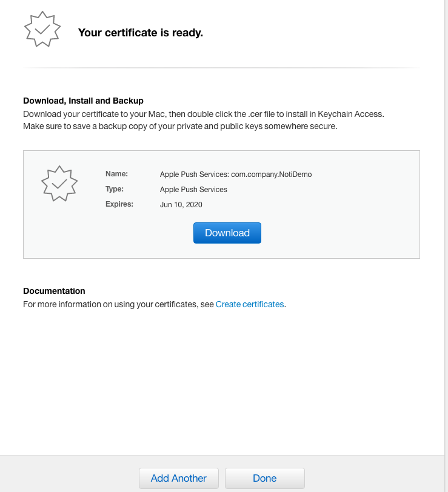

해당 파일을 인증서 키와 같은 위치에 다운로드 해준 후 `Done`

 

 

