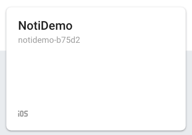

## FCM을 사용해서 푸시 알람 받기

FCM 이란?

Firebase Cloud Messaging 

메세지를 전송할수 있는 서비스

쉽게 말하면 앱에서 푸시 알람 오는 서비스를 구현하는 것중 하나

GCM(google Cloud Messaging) 으로 구현하는 방법도 있다.

<br/>

<br/>

    먼저, Xcode 프로젝트 생성하기 


<br/>

<br/>

 

다음은 키체인 접근 - 인증서 지원 - 인증 기관에서 인증서 요청을 한뒤

<br/>

<br/>


<br/>

<br/>


<br/>

<br/> 

이메일주소를 적어주고 

- [ ] CA로 이메일 보냄

- [x] 디스크에 저장됨
- [x] 본인이 키 쌍 정보 지정

아래 두 항목을 체크해준 뒤에 `계속 ` 을 눌러서 저장 해준다.  (따로 관리할 파일을 만들어도 좋음)

<br/><br/>


키 쌍 정보는 기본값 그대로 2048비트, RSA로 지정해주고 `계속`  

인증서 요청이 디스크에 생성되었습니다. 가 나오면 `완료`


<br/>

<br/>

[apple account cerificate](https://developer.apple.com/account/ios/certificate/) 로 이동


<br/>Identifiers - App IDs에 들어가서 우측 상단의 `+` 버튼을 눌러 추가 해준다.

<br/><br/>


<br/><br/>

여기서 Bundle ID에는 Xcode 프로젝트에 있는 Bundle Identifier을 적어준다.

<br/><br/>


<br/><br/>


<br/>App Services 에서 Push Notifications 를 체크해주고 `Continue`  누르면 다음 화면에 

<br/><br/>


<br/>Push Notifications: Configurable 되있을것이다. `Register` 누르면

<br/><br/>


다음과 같이 등록 된걸 확인할 수 있다.


<br/>

<br/> 

다음은 인증서를 추가하러 가자.


<br/>

Certificates - All 에서 우측 상단에 `+`  누르고

<br/><br/>


<br/>Development 항목이 아닌 Production 항목에서 

- [x] Apple push Notification service SSL (Sandbox & Production) 

항목 체크한 후 `Continue`  

<br/><br/>


<br/>

방금 전에 만든 App ID를 선택하고 `Continue`

<br/>

<br/>


<br/>

처음에 인증서 요청해서 저장했던 인증서를 `Choose Flie`를 선택해서 넣어주고 `Continue`

<br/>

<br/>


해당 파일을 인증서 키와 같은 위치에 다운로드 해준 후 `Done`


<br/>

<br/>

다음은 프로비저닝 프로파일을 생성한다.


**[프로비저닝](https://ko.wikipedia.org/wiki/프로비저닝)**(provisioning)은 사용자의 요구에 맞게 시스템 자원을 할당, 배치, 배포해 두었다가 필요 시 시스템을 즉시 사용할 수 있는 상태로 미리 준비해 두는 것을 말한다. 서버 자원 프로비저닝, OS 프로비저닝, 소프트웨어 프로비저닝, 스토리지 프로비저닝, 계정 프로비저닝 등이 있다. 수동으로 처리하는 '수동 프로비저닝'과 자동화 툴을 이용해 처리하는 '자동 프로비저닝'이 있다. _wiki

<br/>

<br/>


<br/>

<br/>

Provisioning Profiles - All 에서 우측 상단의 `+` 를 누르고

<br/>


<br/>

Developerment에서

- [x] iOS App Development 를 체크한다.

<br/>

<br/>


<br/> 아까 만든 App ID를 선택한다.

<br/>

<br/>


<br/>

등록된 인증서 키를 선택하고,

<br/>

<br/>


<br/>

테스트 할 디바이스를 선택한다

<br/>

<br/>


<br/> 이름을 지정하고 `Continue` 한 후에 

<br/>

<br/>


<br/>

프로비저닝 프로파일을 `Download` 받고 `Done`.

<br/>

<br/>


이제 키체인 접근화면에서 `Apple Push Services: com.company.NotiDemo` 보이면 마우스 우클릭

`내보내기` 해준다. 

이름은 cer로 저장하고 비번 입력 후 연결 허용 대화상자는 항상 허용을 해준다.

 <br/>

 <br/>


방금 보내기 한 키 왼쪽 화살표를 누르면 열쇠모양의 파일이 하나 보일것이다.

이 파일도 위와 마찬가지로 `내보내기`. 

이름은 key로 저장하고 비번 입력 후 연결 허용 대화상자는 항상 허용으로 한다.

<br/>

<br/>

[Firebase](https://console.firebase.google.com/?hl=ko) 로 이동해서 새 프로젝트를 추가한다.

<br/>

<br/>


<br/>

<br/>


<br/>

프로젝트 이름 작성하고 `프로젝트 만들기`

<br/><br/>


<br/>

`계속`

<br/>

<br/>


<br/>

우리는 iOS 프로젝트이므로 iOS를 클릭해서 앱 추가한다.

<br/>

<br/>


<br/>

iOS 번들 ID에 초반에 만든 NotiDemo Xcode 프로젝트 Bundle Identifier를 적어준다.

<br/>


<br/>

<br/>


<br/>

가이드에 따라 GoogleService-Info.plist를 다운받고,

Xcode 프로젝트에 추가한다.

<br/>

<br/>

코코아팟이 설치 되어있지 않으면 아래 명령어로 설치해주고

<br/>

```
$ sudo gem install cocoapods
```

<br/><br/>


<br/>

<br/>

해당 프로젝트로 이동해서 $ pod init 하고 Podfile을 열고 코드 추가 후 

$ pod install 한다.

<br/>


<br/>

<br/>

Xcode 프로젝트 AppDelegate 파일을 다음과 같이 변경해준다.

<br/>

<br/>

[firebase messaging AppDelegate example swift code](https://github.com/firebase/quickstart-ios/blob/d879fa74ef2e5c2ac999ae4a5b18d15087c80df9/messaging/MessagingExampleSwift/AppDelegate.swift#L40-L55) 

<br/>

```swift
import UIKit
import UserNotifications

import Firebase

@UIApplicationMain
class AppDelegate: UIResponder, UIApplicationDelegate {

  var window: UIWindow?
  let gcmMessageIDKey = "gcm.message_id"

  func application(_ application: UIApplication,
                   didFinishLaunchingWithOptions launchOptions: [UIApplication.LaunchOptionsKey: Any]?) -> Bool {

    FirebaseApp.configure()

    // [START set_messaging_delegate]
    Messaging.messaging().delegate = self
    // [END set_messaging_delegate]
    // Register for remote notifications. This shows a permission dialog on first run, to
    // show the dialog at a more appropriate time move this registration accordingly.
    // [START register_for_notifications]
    if #available(iOS 10.0, *) {
      // For iOS 10 display notification (sent via APNS)
      UNUserNotificationCenter.current().delegate = self

      let authOptions: UNAuthorizationOptions = [.alert, .badge, .sound]
      UNUserNotificationCenter.current().requestAuthorization(
        options: authOptions,
        completionHandler: {_, _ in })
    } else {
      let settings: UIUserNotificationSettings =
      UIUserNotificationSettings(types: [.alert, .badge, .sound], categories: nil)
      application.registerUserNotificationSettings(settings)
    }

    application.registerForRemoteNotifications()

    // [END register_for_notifications]
    return true
  }

  // [START receive_message]
  func application(_ application: UIApplication, didReceiveRemoteNotification userInfo: [AnyHashable: Any]) {
    // If you are receiving a notification message while your app is in the background,
    // this callback will not be fired till the user taps on the notification launching the application.
    // TODO: Handle data of notification
    // With swizzling disabled you must let Messaging know about the message, for Analytics
    // Messaging.messaging().appDidReceiveMessage(userInfo)
    // Print message ID.
    if let messageID = userInfo[gcmMessageIDKey] {
      print("Message ID: \(messageID)")
    }

    // Print full message.
    print(userInfo)
  }

  func application(_ application: UIApplication, didReceiveRemoteNotification userInfo: [AnyHashable: Any],
                   fetchCompletionHandler completionHandler: @escaping (UIBackgroundFetchResult) -> Void) {
    // If you are receiving a notification message while your app is in the background,
    // this callback will not be fired till the user taps on the notification launching the application.
    // TODO: Handle data of notification
    // With swizzling disabled you must let Messaging know about the message, for Analytics
    // Messaging.messaging().appDidReceiveMessage(userInfo)
    // Print message ID.
    if let messageID = userInfo[gcmMessageIDKey] {
      print("Message ID: \(messageID)")
    }

    // Print full message.
    print(userInfo)

    completionHandler(UIBackgroundFetchResult.newData)
  }
  // [END receive_message]
  func application(_ application: UIApplication, didFailToRegisterForRemoteNotificationsWithError error: Error) {
    print("Unable to register for remote notifications: \(error.localizedDescription)")
  }

  // This function is added here only for debugging purposes, and can be removed if swizzling is enabled.
  // If swizzling is disabled then this function must be implemented so that the APNs token can be paired to
  // the FCM registration token.
  func application(_ application: UIApplication, didRegisterForRemoteNotificationsWithDeviceToken deviceToken: Data) {
    print("APNs token retrieved: \(deviceToken)")

    // With swizzling disabled you must set the APNs token here.
    // Messaging.messaging().apnsToken = deviceToken
  }
}

// [START ios_10_message_handling]
@available(iOS 10, *)
extension AppDelegate : UNUserNotificationCenterDelegate {

  // Receive displayed notifications for iOS 10 devices.
  func userNotificationCenter(_ center: UNUserNotificationCenter,
                              willPresent notification: UNNotification,
    withCompletionHandler completionHandler: @escaping (UNNotificationPresentationOptions) -> Void) {
    let userInfo = notification.request.content.userInfo

    // With swizzling disabled you must let Messaging know about the message, for Analytics
    // Messaging.messaging().appDidReceiveMessage(userInfo)
    // Print message ID.
    if let messageID = userInfo[gcmMessageIDKey] {
      print("Message ID: \(messageID)")
    }

    // Print full message.
    print(userInfo)

    // Change this to your preferred presentation option
    completionHandler([])
  }

  func userNotificationCenter(_ center: UNUserNotificationCenter,
                              didReceive response: UNNotificationResponse,
                              withCompletionHandler completionHandler: @escaping () -> Void) {
    let userInfo = response.notification.request.content.userInfo
    // Print message ID.
    if let messageID = userInfo[gcmMessageIDKey] {
      print("Message ID: \(messageID)")
    }

    // Print full message.
    print(userInfo)

    completionHandler()
  }
}
// [END ios_10_message_handling]

extension AppDelegate : MessagingDelegate {
  // [START refresh_token]
  func messaging(_ messaging: Messaging, didReceiveRegistrationToken fcmToken: String) {
    print("Firebase registration token: \(fcmToken)")
    
    let dataDict:[String: String] = ["token": fcmToken]
    NotificationCenter.default.post(name: Notification.Name("FCMToken"), object: nil, userInfo: dataDict)
    // TODO: If necessary send token to application server.
    // Note: This callback is fired at each app startup and whenever a new token is generated.
  }
  // [END refresh_token]
  // [START ios_10_data_message]
  // Receive data messages on iOS 10+ directly from FCM (bypassing APNs) when the app is in the foreground.
  // To enable direct data messages, you can set Messaging.messaging().shouldEstablishDirectChannel to true.
  func messaging(_ messaging: Messaging, didReceive remoteMessage: MessagingRemoteMessage) {
    print("Received data message: \(remoteMessage.appData)")
  }
  // [END ios_10_data_message]
}
```

<br/>

<br/>

프로젝트 선택후 TARGETS - NotiDemo - Capabilities 


<br/>

* Background Modes -  **ON**
  * - [x] Remote notifications

<br/>


<br/>

* Push Notifications - **ON**

<br/>

<br/>

다시 firebase로 이동해서 기존에 만들어 두었던 NotiDemo 프로젝트를 클릭해서 들어간다.

<br/>




<br/>

<br/>


<br/>

NotiDemo를 누르고 


<br/>

여기서 ⚙️ 설정으로 가서 `클라우드 메시징`으로 들어간다. 

<br/>


<br/>

<br/>


<br/>

<br/>

iOS 앱 구성 에서 APN 인증서를 등록해준다 

**개발 APN 인증서가 없습니다** 에 `업로드` 를 누르고  

그 전에 다운 받았던 key 인증서를 로드하고 비밀번호 입력 후 업로드한다.

<br/>


<br/>

<br/>


<br/>

메뉴 목록에서 Cloud Messaging을 선택하고 

<br/>

<br/>


<br/>

Send your first message를 클릭하고 푸시를 보내보자.

<br/>

<br/>


<br/>

알림 제목 텍스트를 입력한 후에 

<br/>

<br/>


<br/>

타겟에서 앱 선택을 누르면 `iOS com.company.NotiDemo(NotiDemo)` 그 전에 만들어둔 앱을 선택한다.

<br/>

<br/>


<br/>

스케줄 예약도 가능하지만 Now로 선택해서 즉시 푸시 알람을 받아봄.

<br/>

<br/>


<br/>

나는 추가 옵션으로 key value도 받아 보도록 입력했다.

이제 `검토` 클릭 후 `게시` 를 누르면 해당 디바이스로 푸시 알림이 오는걸 확인할수 있다. 

<br/>

<br/>


<br/>

그리고 Xcode consol 창에도 키와 값이 잘 들어온다.

<br/>

<br/>

<br/>

### 참고링크

* [FCM을 사용한 아이폰 푸시 알림 만들기](https://m.blog.naver.com/PostView.nhn?blogId=whdals0&logNo=221117010124&proxyReferer=https%3A%2F%2Fwww.google.com%2F)

<br/>