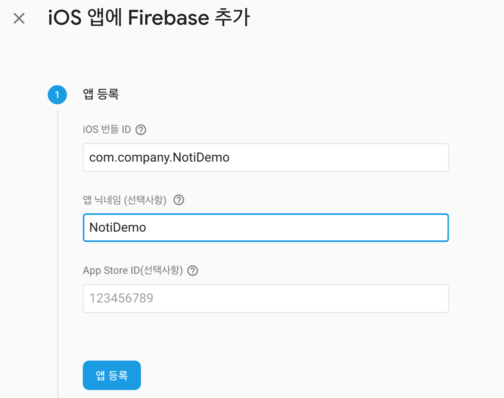

## FCM을 사용해서 푸시 알람 받기

FCM 이란?

Firebase Cloud Messaging 

메세지를 전송할수 있는 서비스

쉽게 말하면 앱에서 푸시 알람 오는 서비스를 구현하는 것중 하나

GCM(google Cloud Messaging) 으로 구현하는 방법도 있다.

<br/>

<br/>

    먼저, Xcode 프로젝트 생성하기 


<br/>

<br/>

 

다음은 키체인 접근 - 인증서 지원 - 인증 기관에서 인증서 요청을 한뒤

<br/>

<br/>


<br/>

<br/>


<br/>

<br/> 

이메일주소를 적어주고 

- [ ] CA로 이메일 보냄

- [x] 디스크에 저장됨
- [x] 본인이 키 쌍 정보 지정

아래 두 항목을 체크해준 뒤에 `계속 ` 을 눌러서 저장 해준다.  (따로 관리할 파일을 만들어도 좋음)

<br/><br/>


키 쌍 정보는 기본값 그대로 2048비트, RSA로 지정해주고 `계속`  

인증서 요청이 디스크에 생성되었습니다. 가 나오면 `완료`


<br/>

<br/>

[apple account cerificate](https://developer.apple.com/account/ios/certificate/) 로 이동


<br/>Identifiers - App IDs에 들어가서 우측 상단의 `+` 버튼을 눌러 추가 해준다.

<br/><br/>


<br/><br/>

여기서 Bundle ID에는 Xcode 프로젝트에 있는 Bundle Identifier을 적어준다.

<br/><br/>


<br/><br/>


<br/>App Services 에서 Push Notifications 를 체크해주고 `Continue`  누르면 다음 화면에 

<br/><br/>


<br/>Push Notifications: Configurable 되있을것이다. `Register` 누르면

<br/><br/>


다음과 같이 등록 된걸 확인할 수 있다.


<br/>

<br/> 

다음은 인증서를 추가하러 가자.


<br/>

Certificates - All 에서 우측 상단에 `+`  누르고

<br/><br/>


<br/>Development 항목이 아닌 Production 항목에서 

- [x] Apple push Notification service SSL (Sandbox & Production) 

항목 체크한 후 `Continue`  

<br/><br/>


<br/>

방금 전에 만든 App ID를 선택하고 `Continue`

<br/>

<br/>


<br/>

처음에 인증서 요청해서 저장했던 인증서를 `Choose Flie`를 선택해서 넣어주고 `Continue`

<br/>

<br/>


해당 파일을 인증서 키와 같은 위치에 다운로드 해준 후 `Done`


<br/>

<br/>

다음은 프로비저닝 프로파일을 생성한다.


**[프로비저닝](https://ko.wikipedia.org/wiki/프로비저닝)**(provisioning)은 사용자의 요구에 맞게 시스템 자원을 할당, 배치, 배포해 두었다가 필요 시 시스템을 즉시 사용할 수 있는 상태로 미리 준비해 두는 것을 말한다. 서버 자원 프로비저닝, OS 프로비저닝, 소프트웨어 프로비저닝, 스토리지 프로비저닝, 계정 프로비저닝 등이 있다. 수동으로 처리하는 '수동 프로비저닝'과 자동화 툴을 이용해 처리하는 '자동 프로비저닝'이 있다. _wiki

<br/>

<br/>


<br/>

<br/>

Provisioning Profiles - All 에서 우측 상단의 `+` 를 누르고

<br/>


<br/>

Developerment에서

- [x] iOS App Development 를 체크한다.

<br/>

<br/>


<br/> 아까 만든 App ID를 선택한다.

<br/>

<br/>


<br/>

등록된 인증서 키를 선택하고,

<br/>

<br/>


<br/>

테스트 할 디바이스를 선택한다

<br/>

<br/>


<br/> 이름을 지정하고 `Continue` 한 후에 

<br/>

<br/>


<br/>

프로비저닝 프로파일을 `Download` 받고 `Done`.

<br/>

<br/>


이제 키체인 접근화면에서 `Apple Push Services: com.company.NotiDemo` 보이면 마우스 우클릭

`내보내기` 해준다. 

이름은 cer로 저장하고 비번 입력 후 연결 허용 대화상자는 항상 허용을 해준다.

 <br/>

 <br/>


방금 보내기 한 키 왼쪽 화살표를 누르면 열쇠모양의 파일이 하나 보일것이다.

이 파일도 위와 마찬가지로 `내보내기`. 

이름은 key로 저장하고 비번 입력 후 연결 허용 대화상자는 항상 허용으로 한다.

<br/>

<br/>

[Firebase](https://console.firebase.google.com/?hl=ko) 로 이동해서 새 프로젝트를 추가한다.

<br/>

<br/>


<br/>

<br/>


<br/>

프로젝트 이름 작성하고 `프로젝트 만들기`

<br/><br/>


<br/>

`계속`

<br/>

<br/>


<br/>

우리는 iOS 프로젝트이므로 iOS를 클릭해서 앱 추가한다.

<br/>

<br/>



<br/>

iOS 번들 ID에 초반에 만든 NotiDemo Xcode 프로젝트 Bundle Identifier를 적어준다.

<br/>


<br/>

<br/>


<br/>

가이드에 따라 GoogleService-Info.plist를 다운받고,

Xcode 프로젝트에 추가한다.

<br/>

<br/>

코코아팟이 설치 되어있지 않으면 아래 명령어로 설치해주고

<br/>

```
$ sudo gem install cocoapods
```

<br/><br/>


<br/>

<br/>

해당 프로젝트로 이동해서 $ pod init 하고 Podfile을 열고 코드 추가 후 

$ pod install 한다.

<br/>


<br/>

Xcode 프로젝트 AppDelegate 파일을 다음과 같이 변경해준다.


<br/>


### 참고링크

* [FCM을 사용한 아이폰 푸시 알림 만들기](https://m.blog.naver.com/PostView.nhn?blogId=whdals0&logNo=221117010124&proxyReferer=https%3A%2F%2Fwww.google.com%2F)

<br/>