# ScrollView

<br/>

**🧐 A view that allows the scrolling and zooming of its contained views.**

<br/>

<br/>

### 스토리보드로 스크롤뷰 만들기

---


 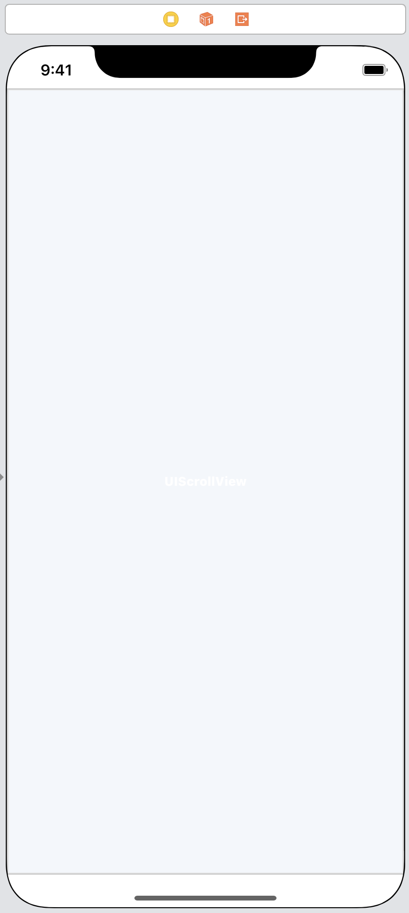 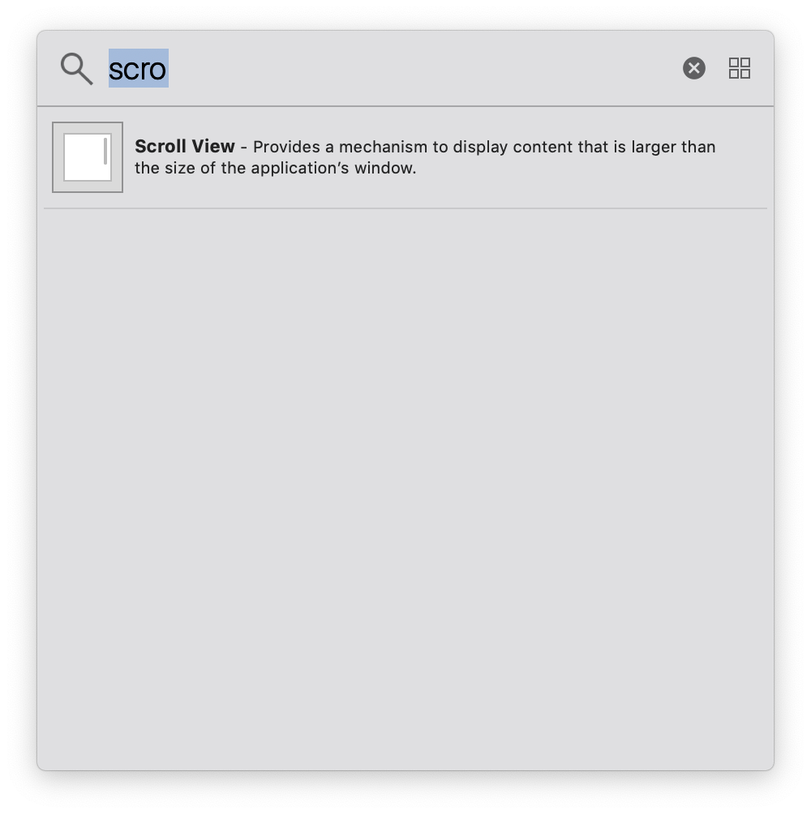


<br/>

<br/>

스크롤뷰를 추가한 후에 constraints 모두 0으로 주고 화면에 꽉 차게 한다

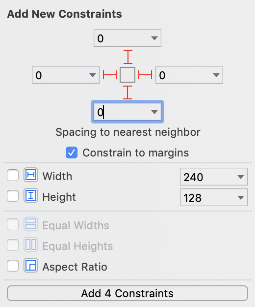


<br/>

<br/>

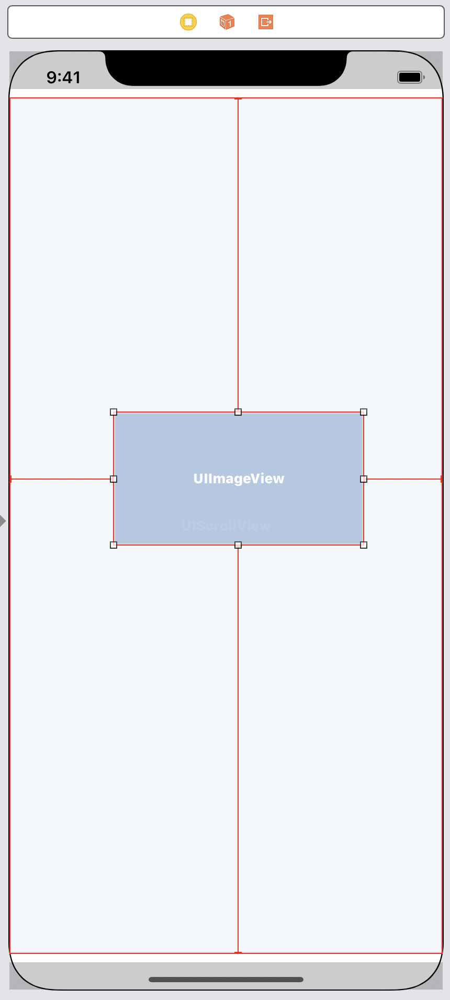 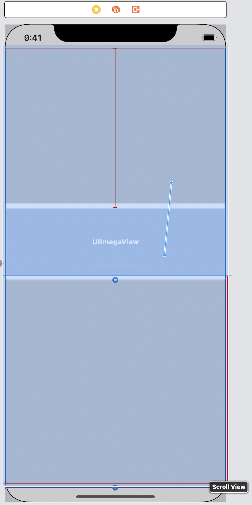


<br/>

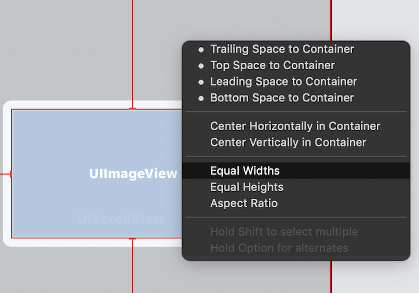

이미지뷰도 스크롤 뷰와 같이 constraints 를 준 후에 

스크롤뷰와 Equal Widths, Equal Heights 같도록 설정해준다.

<br/>

<br/>

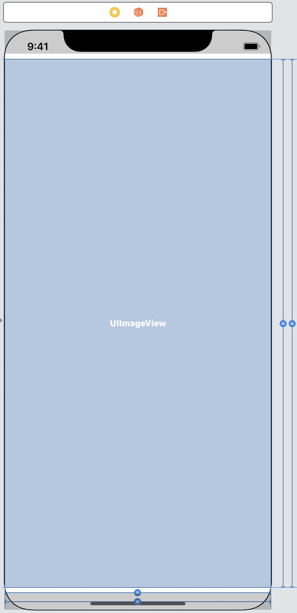


<br/>

이렇게 스토리뷰 설정을 완료하고 하나 더 남았음

<br/><br/>

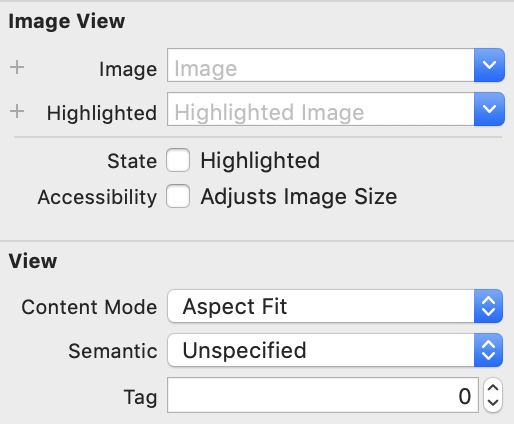

<br/>

이미지뷰를 선택한 후 attributes inspector에서 View Content Mode를 Aspect Fit로 변경해주고

<br/>

* Content Mode

> Content Mode에서 Scale은 비율을 유지하지 않는다
>
> Aspect는 비율을 유지한다.
>
> Fill은 여백을 남기지 않고 모두 채운다.
>
> Fit은 영역안에 이미지를 맞춘다.
>
> Aspect Fill은 비율을 유지하면서 여백없이 채우므로 원본이미지가 잘려나간다.
>
> Aspect Fit은 비율을 유지하면서 영역안에 맞추므로 여백이 생긴다.


<br/>

<br/>


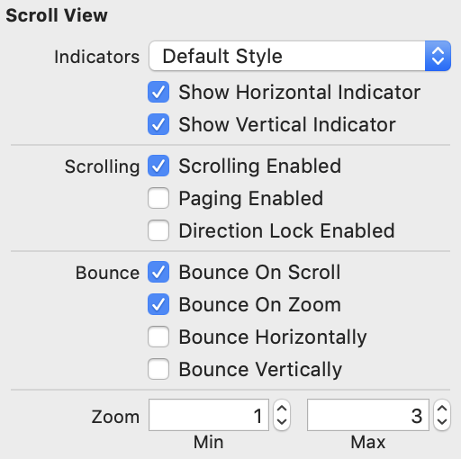

<br/>

스크롤 뷰는 Zoom Max를 변경해준다.

Max로 최대 몇배까지 확대 할것인지 설정한다.

<br/>

<br/>

<br/>

이제 VC로 가서 약간에 코드만 작성하면 완료! 

```swift
class ViewController: UIViewController {

    @IBOutlet weak var scrollView: UIScrollView!
    @IBOutlet weak var imageView: UIImageView!
    
    override func viewDidLoad() {
        super.viewDidLoad()
        imageView.image = UIImage(named: "night.jpg")
        scrollView.delegate = self
    }

}

extension ViewController: UIScrollViewDelegate {
    
    func viewForZooming(in scrollView: UIScrollView) -> UIView? {
        return self.imageView
    }
    
}

```


<br/>

<br/>


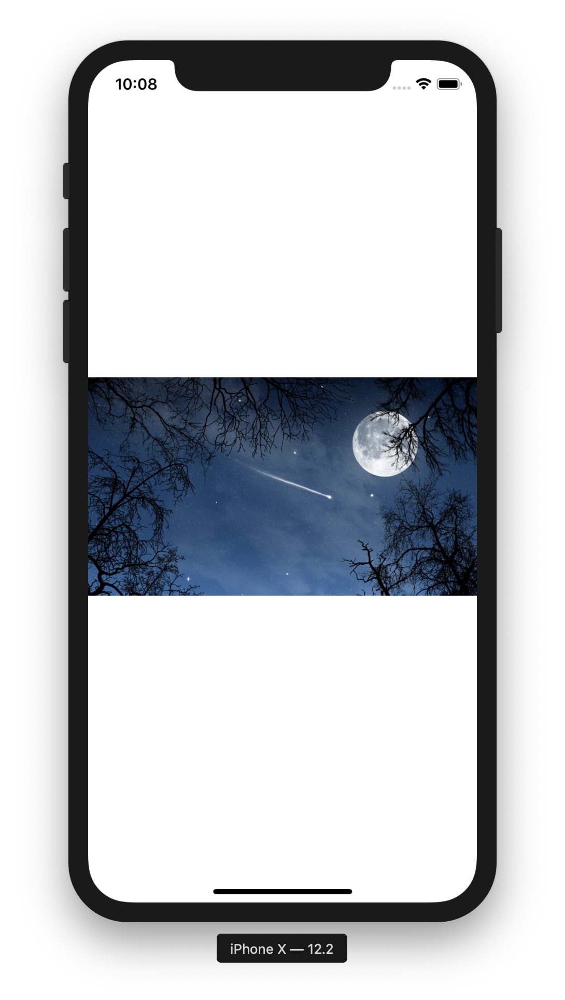

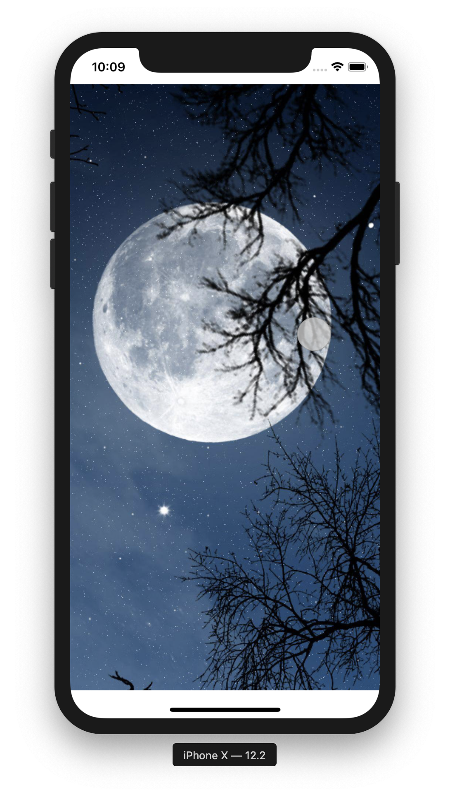

<br/>

시뮬레이터로 실행시 option키를 누르고 마우스를 조절하면 이렇게 이미지를 Zoom 할수있다!

<br/>

<br/>


### 참고링크

* ScrollView
  * [부스트코스_ 스크롤뷰로 이미지 확대하기](https://www.edwith.org/boostcourse-ios/lecture/16901/)

* Content mode
  * [ImageView ContentMode에 따른 이미지 표시](https://oneday0012.tistory.com/119)
  * [UIView Mode 속성](http://blog.naver.com/PostView.nhn?blogId=newyorkinms&logNo=220776133555&parentCategoryNo=31&categoryNo=&viewDate=&isShowPopularPosts=true&from=search)