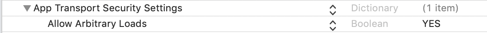

##  Synchronous(동기) VS  Asynchronous(비동기)

Sync에서는 System Call이 끝날때까지 기다린다

Async에서는 A코드 System Call이 완료되지 않아도 B코드를 실행하다가 A코드 System Call이 완료되면

결과를 출력한다.


<br/>

<br/>

<br/>

## Operation Queue

연산(operation)의 실행을 관리하고 대기열의 동작을 관리한다.

연산을 대기열에서 제거하는 방법은 cancel() 메서드로 연산을 취소하는 방법 뿐이다.

cancelAllOperations()메서드를 호출하면 대기열에 있는 모든 연산을 취소할수 있다. 

실행중인 연산의 경우 연산 객체의 취소 상태를 확인하고 실행 중인 연산을 중지하고 완료 상태로 변경된다.


<br/>

<br/>

<br/>

image url이 `https`가 아닌 ` http` 일 경우에는 info.plist 에서 

App Transport Security Setting를 추가한 후에  Allow Arbitrary Loads 를 Yes 로 해주면 된다.




<br/>

<br/>

<br/>

URL로 부터 데이터를 가져오는 메서드는 sync 동기 메서드다.


그래서 Data를 가져오기 전까지는 다음 줄로 넘어가지 않으므로 버튼이 비활성화 되어있어서

사용자는 앱이 멈췄다고 생각할지도 모른다.

<br/>

<br/>

메인스레드에서 동작하는 코드

```swift
    @IBOutlet weak var imageView: UIImageView!
    let imageURL = "https://image.fmkorea.com/files/attach/images/486263/239/768/060/81544818b7b8729039bd6f8dd057564d.jpg"
    

    @IBAction func touchedDownloadButton(_ sender: UIButton) {
        
        if let url = URL(string: imageURL) {
            do {
                let imageData = try Data(contentsOf: url)
                if let image = UIImage(data: imageData) {
                    self.imageView.image = image
                }
            } catch {
                print("error: \(error)")
            }
            
        }
        
    }
```


<br/>

<br/>

<br/>

메인스레드에서 동작하는 코드를 operation queue를 사용해서 메인스레드가 아닌 다른스레드로 보내보자

operation queue를 하나 생성해주고 `OperationQueue()`  `.addOperation` 해준다.

```swift
        OperationQueue().addOperation {
            if let url = URL(string: self.imageURL) {
                do {
                    let imageData = try Data(contentsOf: url)
                    if let image = UIImage(data: imageData) {
                        self.imageView.image = image
                    }
                } catch {
                    print("error: \(error)")
                }
                
            }
        }
```

<br/>

실행하면 해당 경고를 확인할수 있다


<br/>


UIImage는 메인스레드에서만 사용되어야 한다.

UI와 관련된 코드는 메인스레드에서 동작을 해야한다.

<br/>

```swift
        OperationQueue().addOperation {
            if let url = URL(string: self.imageURL) {
                do {
                    let imageData = try Data(contentsOf: url)
                    if let image = UIImage(data: imageData) {
                        OperationQueue.main.addOperation {
                            self.imageView.image = image
                        }
                    }
                } catch {
                    print("error: \(error)")
                }
                
            }
        }
```

정리하면 이미지 데이터를 가져오는 작업은 자식 스레드를 만들어서 뒤에서 백그라운드로 작업을 하게 하고

그 다음에 이 작업이 끝나면 메인스레드로 가져와서 이 코드를 실행한다는 의미다.

이제 실행하면 이미지 가져오는 동안 버튼도 활성화 되있고 프리즈 되지 않는다.

그리고 이미지도 다운로드가 완료된 이후에 셋팅이 된다.

큰 데이터, 다량의 이미지들을 가져오는 작업 등을 메인 스레드에서 하다보면 

그 작업이 끝날 때까지 화면이 멈추고 끊기는 현상들이 발생하기 때문에

이러한 처리들은 오퍼레이션나 gcd를 활용해서 이런 처리들을 백그라운드에서 해주고

그리고 그 결과를 UI에 보여줄때 메인스레드에서 하도록 한다.

백그라운드와 메인스레드를 왔다갔다하면서 적절히 처리할 필요가 있다.


<br/>

<br/>

<br/>


### 참고링크


[부스트코스 iOS프로그래밍 - Operation Queue](https://www.edwith.org/boostcourse-ios/lecture/16898/)

[부스트코스 iOS프로그래밍 - Operation Queue 로 비동기 프로그래밍](https://www.edwith.org/boostcourse-ios/lecture/16899/)