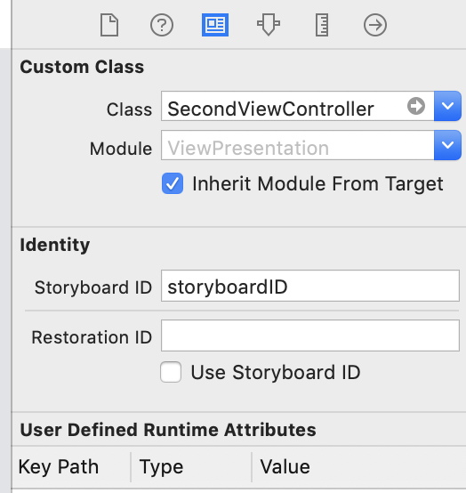

## 화면 전환하기

<br/>

<br/>

### 뷰를 이용한 화면 전환

<br/>

하나의 VC에서 여러개의 루트 뷰를 상태에 맞게 뷰를 바꾸거나 기존 뷰 위에 덮어쓰면서 보여준다.

다만 MVC 패턴에 어긋나고 이전 화면으로 되돌아갈 때 처리 등 고려할 사항이 많아서 지양하는 편으로

한 개의 VC에 한 개의 루트 뷰를 권장.

뷰를 이용한 화면 전환을 할땐 커스텀 세그를 이용한다.

<br/>

<br/>

### VC 직접 호출에 의한 화면 전환

<br/>

현재의 VC에서 이동할 VC를 직접 호출해서 화면에 표시한다. Presentation 방식

<br/>

```swift
    @IBAction func touchNextButton(_ sender: Any) {
        
        if let secondView = self.storyboard?.instantiateViewController(withIdentifier: "storyboardID") {
            secondView.modalTransitionStyle = UIModalTransitionStyle.flipHorizontal
            self.present(secondView, animated: true)
        }
        
    }
    
```

<br/>

<br/>

화면 전환시 애니메이션 타입

* coverVertical - 모달 형식
* crossDissolve - 번인아웃되면서 화면 변경
* partialCurl - 페이징 효과
* flipHorizontal - 화면 flip

<br/>

<br/>




<br/>

스토리보드에 Identity - Stroryboard ID를 넣어줘야함. 

<br/>

<br/>

<br/>

<br/>

<br/>

<br/>

<br/>

<br/>

<br/>


